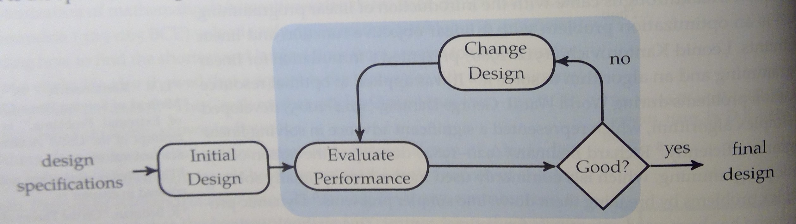

# Introduction

## Design Process

<!-- bild aus kochenderfer, S. 4 -->

## Basic Optimisation Problem

Terms:

- design point
- design variable
- objective function
- feasible set
- solution
- constraints

## Critical Points

- global min
- weak local min
- strong local min
- inflection

other stuff
- univariate/multivariate
- single/multi objective
- continuous/discrete
- multidisciplinary

## Content

### unconstrained

- continuous, convex: gradient, 1st and 2nd order methods
- direct methods, derivative-free, coordinate descent
- search
- local search (hill climbing, simulated annealing, cross entropy, evolution)
- population methods (GA, Particle Swarm

### constrained

- langrange multipliers, penalty methods
- constraint satisfaction problems
- linear programming (simplex, interior point)

### Multiobjective

- Pareto frontier
- weight method

### xx
- Bayes Optimisation
- uncertainty propagation ???
- Bayesian Monte Carlo

### discrete stuff

- branch and bound
- search!!!!
- shortest path
- dynamic programming?
- greedy local search
- ant colony

### surrogate models

### Design Of Experiments

### MDO

- sequential
- simultaneous

## Tools

- HyperStudy
- Scipy
- MiniZinc, ORTools, Z3, COIN-OR
- GP optimiser
- PyOMO
- ...

## Beispiele

- CSP: Sudoku
- Search: something
- local search (shortest path)
- 